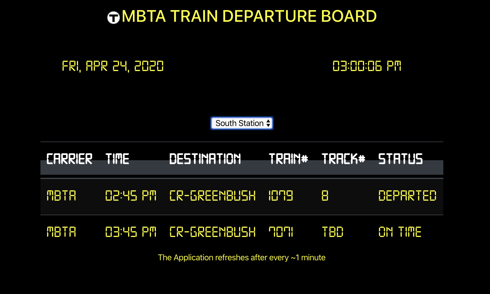

# Live Commuter Rail departure board

This application shows the upcoming departures at North and South stations in Boston, the train destinations, the departure times, the track numbers, and the boarding status (e.g. 'Boarding', 'All Aboard', 'Delayed').
The real-time data is read from [https://www.mbta.com/developers/v3-api](https://www.mbta.com/developers/v3-api).

The app refreshes every ~1 minute.

## Instructions
In the project directory, run `npm install` to install the necessary modules.
Running `npm start` will launch the app in development mode on [http://localhost:3000](http://localhost:3000). Chrome is preferred.

## 
This project was bootstrapped with [Create React App](https://github.com/facebook/create-react-app).
